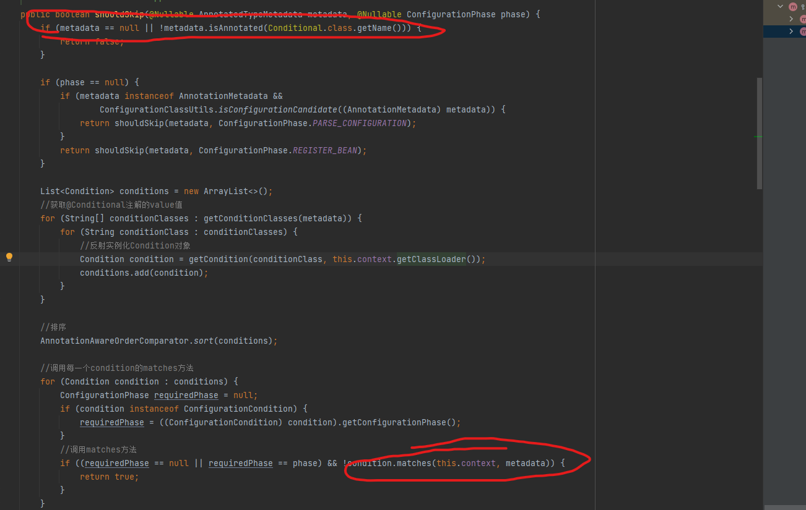

 # 这个框架是可以通过自定义的配置属性决定是否实例化bean，并被spring管理
 
 其实就是通过自定义的condition接口,来实现对某个类,满足某个条件的时候我们就进行实例化
 
首先我先入为主给你灌输两个概念:  
     1 spring的注解上下文为AnnotationConfigApplicationContext
     2 处理spring类的注解的信息其实是一个beanPostProcessor接口的实现类为:ConfigurationClassPostProcessor
    好了有了以上两个概念之后,我们来到ConfigurationClassPostProcessor这个类的这个方法processConfigBeanDefinitions
    其中有一行代码:  parser.parse(candidates);这行代码其实就是把类上面的特殊注解解析出来最终封装成beanDefinition,我们进入这个方法里面,
    会看到有这么一行代码:
            //对@Condition注解的支持，过滤掉不需要实例化的类
            if (this.conditionEvaluator.shouldSkip(configClass.getMetadata(), ConfigurationPhase.PARSE_CONFIGURATION)) {
             return;
}   以上代码就是处理就是Conditional处理的核心,我们进入到shouldSkip这个方法:
        
    看到图片上的两个红色圈圈的地方，你应该知道了吧。

